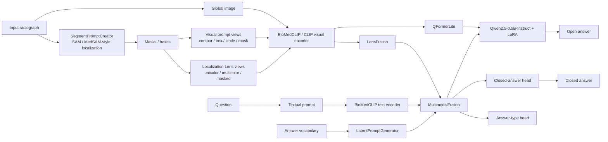

# BoneVQA-Prompt

**BoneVQA-Prompt** is a research-oriented medical visual question answering (VQA) system for bone and radiographic images. The repository combines **visual prompting**, **textual prompting**, **latent prompting**, localization-aware image views, multimodal fusion, and a lightweight instruction-tuned language model to answer both closed-ended and open-ended questions.

The implementation is designed around a three-stage training workflow using **ROCO**, **PMC-VQA**, and downstream VQA datasets such as **FracAtlas-VQA** and **VQA-RAD**. It also includes ablation experiments, leakage-aware evaluation modes, statistical analysis scripts, single-image inference, and a FastAPI-based interactive demo.

> **Research use only.** This code is a research prototype and is **not** a medical device. Its outputs must not be used for clinical diagnosis or patient-management decisions.

---

## 1. Main Features

- Multi-level prompting for medical VQA:
  - **Visual prompt**: contour, box, circle, or mask overlays around localized regions.
  - **Textual prompt**: structured question context for bone radiographs.
  - **Latent prompt**: learnable latent tokens conditioned through multimodal attention and an answer-bank prior.
- Localization-aware visual processing using SAM/MedSAM-style segmentation prompts.
- BioMedCLIP-based visual and text encoders, with a CLIP fallback.
- Parameter-efficient adaptation with LoRA for the visual encoder and LLM.
- Q-Former-like visual prompt compression.
- Localization Lens-style multi-view fusion.
- Closed-answer classification and open-answer generation in one model.
- Three-stage training pipeline:
  1. ROCO image-text alignment.
  2. PMC-VQA multimodal pretraining.
  3. Downstream VQA fine-tuning on FracAtlas-VQA or VQA-RAD.
- Evaluation modes for studying ground-truth localization leakage:
  - ground-truth mask/box mode,
  - clinician-assisted box mode,
  - detector-proposed box mode,
  - fully automatic mode without ground-truth masks or boxes.
- Prompt ablation experiments.
- Test-time augmentation across multiple visual-prompt styles.
- Statistical testing and extended open-answer metrics.
- FastAPI + browser demo with English/Vietnamese question handling and clinician feedback logging.

---

## 2. Architecture Overview

At a high level, the model processes the original radiograph, localized prompt views, and question text through separate encoders before multimodal fusion.



The default model configuration uses:

- `microsoft/BiomedCLIP-PubMedBERT_256-vit_base_patch16_224` through `open_clip`;
- `openai/clip-vit-base-patch16` as a fallback;
- `Qwen/Qwen2.5-0.5B-Instruct` for open-answer generation;
- a SAM/MedSAM-compatible segmentation component configured through `model.sam`;
- LoRA adapters for parameter-efficient training.

---

## 3. Training Objective

The model combines several losses during training:

- closed-answer classification loss;
- language-model loss for generated answers;
- answer-type classification loss;
- latent-prompt consistency loss;
- image-text contrastive loss.

The implementation selects decoupled contrastive learning during Stage 1 and supports InfoNCE-style contrastive learning in later stages.

---

## 4. Three-Stage Training Pipeline

### Stage 1 — ROCO image-text alignment

ROCO captions are converted into open-ended VQA-style records. This stage primarily aligns visual and textual representations.

Typical configuration:

```text
configs/stage1_roco_full.yaml
```

### Stage 2 — PMC-VQA pretraining

The Stage 1 checkpoint is used to initialize multimodal VQA pretraining on PMC-VQA.

Typical configuration:

```text
configs/stage2_pmcvqa_full.yaml
```

### Stage 3 — downstream VQA fine-tuning

The Stage 2 checkpoint is fine-tuned on a downstream task.

Available configurations include:

```text
configs/stage3_fracatlas_full.yaml
configs/stage3_vqa_rad_full.yaml
configs/stage3_vqa_rad_v3a.yaml
configs/stage3_vqa_rad_v3b.yaml
configs/stage3_vqa_rad_v3c.yaml
```

Additional configurations under `configs/` cover larger-scale experiments and prompt/localization ablations.

---

## 5. Repository Structure

```text
.
├── app/
│   ├── api.py                  # FastAPI application
│   ├── inference.py            # Real/model and mock inference engines
│   ├── ngon_ngu.py             # Vietnamese/English mapping utilities
│   ├── static/                 # Browser UI and example images
│   └── tests/                  # Playwright end-to-end tests
│
├── configs/
│   ├── base.yaml
│   ├── stage1_roco*.yaml
│   ├── stage2_pmcvqa*.yaml
│   ├── stage3_fracatlas*.yaml
│   ├── stage3_vqa_rad*.yaml
│   └── ablation_fracatlas*.yaml
│
├── scripts/
│   ├── prepare_data.py         # Build/inspect dataset records
│   ├── smoke_test_model.py     # Model smoke test
│   ├── eda.py                  # Dataset EDA and figures
│   ├── huan_luyen_bo_phat_hien.py
│   ├── sinh_box_bo_phat_hien.py
│   ├── danh_gia_mask.py
│   ├── danh_gia_metric_mo_rong.py
│   ├── kiem_dinh_thong_ke.py
│   ├── tong_hop_ket_qua.py
│   └── ...
│
├── src/
│   ├── train.py                # Training entry point
│   ├── evaluate.py             # Evaluation entry point
│   ├── predict.py              # Single-image inference
│   ├── utils.py
│   ├── data/
│   │   ├── common.py
│   │   ├── fracatlas_vqa.py
│   │   ├── pmc_vqa.py
│   │   ├── roco.py
│   │   ├── vqa_rad.py
│   │   └── prompts.py
│   └── models/
│       ├── bonevqa.py
│       ├── encoders.py
│       ├── fusion.py
│       ├── latent_prompt.py
│       ├── lens_fusion.py
│       ├── segment_prompt.py
│       ├── heads.py
│       └── losses.py
│
├── tests/
│   ├── test_dinh_tuyen_cau_hoi.py
│   └── test_ngon_ngu.py
│
├── requirements.txt
├── package.json
└── playwright.config.ts
```

Some file and function names are Vietnamese because the original experimental codebase was developed with Vietnamese logging and research utilities. The core Python APIs remain straightforward to use from the command line.

---

## 6. Requirements

A recent Python environment is recommended. The repository declares:

- PyTorch `>=2.5`;
- torchvision;
- transformers `>=4.45`;
- PEFT `>=0.13`;
- accelerate;
- open_clip_torch `>=2.26`;
- timm;
- OpenCV;
- NumPy, Pillow, scikit-learn, NLTK, matplotlib, seaborn;
- FastAPI and Uvicorn;
- pytest;
- Hugging Face Hub and SentencePiece.

Install the Python dependencies with:

```bash
python -m pip install --upgrade pip
pip install -r requirements.txt
```

### Platform note

The checked-in `requirements.txt` contains both a CUDA PyTorch extra index and `pywin32`, reflecting the original Windows development environment.

On non-Windows systems, `pywin32` should be omitted. Also note that the current `src.utils.get_device()` implementation automatically selects **CUDA** when available and otherwise falls back to **CPU**; it does not currently select Apple MPS automatically.

The repository also contains several Windows-specific absolute paths such as:

```text
D:/BaoYen_work/...
```

These must be changed before running the original configs on another machine.

---

## 7. Path Configuration

Two path mechanisms are used by the current codebase.

### 7.1 Dataset root

Dataset loaders read the environment variable:

```text
BONEVQA_DATA
```

If it is not defined, they fall back to:

```text
D:\BaoYen_work\data
```

Linux/macOS example:

```bash
export BONEVQA_DATA=/path/to/data
```

Windows PowerShell example:

```powershell
$env:BONEVQA_DATA="D:\BaoYen_work\data"
```

### 7.2 Checkpoints, reports, and caches

Edit `configs/base.yaml` for your machine, especially:

```yaml
work_dir: D:/BaoYen_work
checkpoint_dir: D:/BaoYen_work/checkpoints
report_dir: reports
figure_dir: reports/figures
```

Stage-specific configuration files also contain `init_from` paths. You may either edit those YAML files or override the initialization checkpoint with `--init_from` when training.

---

## 8. Dataset Preparation

The supported dataset names are:

```text
fracatlas
vqa_rad
roco
pmc_vqa
```

A practical dataset layout is:

```text
$BONEVQA_DATA/
├── fracatlas/
│   └── FracAtlas/
│       ├── dataset.csv
│       ├── images/
│       │   ├── Fractured/
│       │   └── Non_fractured/
│       └── Annotations/
│           └── COCO JSON/
│               └── COCO_fracture_masks.json
│
├── roco/
│   ├── train.json
│   ├── val.json
│   ├── test.json
│   ├── images/
│   └── hf/data/              # optional source parquet files
│
├── pmc_vqa/
│   ├── train.json
│   ├── val.json              # optional; otherwise derived from train
│   ├── test.json
│   ├── train_lon.json        # optional large-training split
│   ├── images/
│   └── hf/data/              # optional source parquet files
│
└── vqa_rad/
    ├── train.json
    ├── test.json
    └── ... image files referenced by the JSON records
```

### FracAtlas-VQA generation

The repository constructs VQA records from the original FracAtlas metadata and COCO fracture annotations. Image-level train/validation/test splitting is performed with a fixed seed.

Generate or rebuild prepared data and answer vocabularies with:

```bash
python scripts/prepare_data.py --force
```

To prepare selected datasets only:

```bash
python scripts/prepare_data.py --datasets fracatlas vqa_rad
```

### ROCO and PMC-VQA parquet export

The ROCO and PMC-VQA loaders can export local JSON/image representations from Hugging Face-style parquet files when the expected JSON files are not already present. The parquet source files are expected under each dataset's `hf/data/` directory.

---

## 9. Quick Smoke Test

Before a full training run, execute the model smoke test:

```bash
python scripts/smoke_test_model.py
```

The script performs a forward/backward pass, tests closed/open inference, saves prompt/lens examples, and verifies checkpoint save/reload behavior.

The current script contains original Windows output paths, so update those paths before using it on another system.

---

## 10. Training

Training is launched as a Python module from the repository root.

### Stage 1

```bash
python -m src.train --config configs/stage1_roco_full.yaml
```

### Stage 2

```bash
python -m src.train \
  --config configs/stage2_pmcvqa_full.yaml \
  --init_from /path/to/stage1_roco_full/best.pt
```

### Stage 3 — FracAtlas-VQA

```bash
python -m src.train \
  --config configs/stage3_fracatlas_full.yaml \
  --init_from /path/to/stage2_pmcvqa_full/best.pt
```

### Stage 3 — VQA-RAD

```bash
python -m src.train \
  --config configs/stage3_vqa_rad_full.yaml \
  --init_from /path/to/stage2_pmcvqa_full/best.pt
```

### Useful command-line overrides

`src.train` supports:

```text
--stage {1,2,3}
--dataset {roco,pmc_vqa,vqa_rad,fracatlas}
--max_samples N
--epochs N
--batch_size N
--resume CHECKPOINT
--init_from CHECKPOINT
--run_name NAME
--seed N
--no_llm
--ablation visual_prompt,latent_prompt,lens
```

Example:

```bash
python -m src.train \
  --config configs/ablation_fracatlas.yaml \
  --ablation visual_prompt,latent_prompt \
  --run_name fracatlas_no_visual_no_latent
```

---

## 11. Checkpoints and Resume

Each run writes to:

```text
<checkpoint_dir>/<run_name>/
```

Typical outputs include:

```text
best.pt
last.pt
config.json
history.json
optimizer.pt        # only when enabled by config
```

The model checkpoint stores trainable model tensors, the model configuration, and the answer vocabulary.

Resume training with:

```bash
python -m src.train \
  --config configs/stage3_fracatlas_full.yaml \
  --resume /path/to/run/last.pt
```

---

## 12. Evaluation

General evaluation syntax:

```bash
python -m src.evaluate \
  --checkpoint /path/to/best.pt \
  --dataset fracatlas \
  --split test \
  --tag experiment_name
```

The default evaluation produces:

- closed-question accuracy;
- open-question exact-match accuracy;
- open-answer recall;
- BLEU-1;
- overall accuracy;
- per-example predictions;
- yes/no confusion-matrix figures.

Results are written under `reports/` and figures under `reports/figures/` unless overridden.

### Leakage-aware localization protocols

The repository includes explicit evaluation controls for studying how ground-truth localization information affects results.

#### A. Fully automatic evaluation

Do not use ground-truth masks, ground-truth boxes, or anatomy-region text:

```bash
python -m src.evaluate \
  --checkpoint /path/to/best.pt \
  --dataset fracatlas \
  --split test \
  --khong_dung_mask_that \
  --khong_dung_region \
  --tag automatic_clean
```

#### B. Clinician-assisted box evaluation

Remove ground-truth masks but keep bounding boxes as localization prompts:

```bash
python -m src.evaluate \
  --checkpoint /path/to/best.pt \
  --dataset fracatlas \
  --split test \
  --che_do_ho_tro \
  --khong_dung_region \
  --tag clinician_box
```

#### C. Detector-proposed boxes

```bash
python -m src.evaluate \
  --checkpoint /path/to/best.pt \
  --dataset fracatlas \
  --split test \
  --box_bo_phat_hien /path/to/predicted_boxes.json \
  --khong_dung_region \
  --tag detector_box
```

### Inference-time prompt ablation

```bash
python -m src.evaluate \
  --checkpoint /path/to/best.pt \
  --dataset fracatlas \
  --ablation visual_prompt,lens \
  --tag no_visual_no_lens
```

### Visual-prompt TTA

```bash
python -m src.evaluate \
  --checkpoint /path/to/best.pt \
  --dataset fracatlas \
  --tta_kinds contour,box,circle,mask \
  --tag tta_four_prompts
```

---

## 13. Single-Image Inference

Use `src.predict` to ask a question about one image:

```bash
python -m src.predict \
  --checkpoint /path/to/best.pt \
  --image /path/to/xray.jpg \
  --question "Is there a fracture in this X-ray?"
```

Optional manually supplied boxes:

```bash
python -m src.predict \
  --checkpoint /path/to/best.pt \
  --image /path/to/xray.jpg \
  --question "Where is the fracture located?" \
  --boxes "60,50,170,150" \
  --prompt_kind contour
```

Multiple boxes are separated by semicolons:

```text
x1,y1,x2,y2;x1,y1,x2,y2
```

Supported visual prompt kinds are:

```text
contour
box
circle
mask
```

The command saves both the generated visual-prompt image and localization-lens image under `reports/predictions/` by default.

---

## 14. Interactive Web Demo

The repository includes a browser interface backed by FastAPI.

Set the trained checkpoint path:

Linux/macOS:

```bash
export BONEVQA_CKPT=/path/to/best.pt
```

Windows PowerShell:

```powershell
$env:BONEVQA_CKPT="D:\path\to\best.pt"
```

Then launch the server:

```bash
python -m uvicorn app.api:app --host 0.0.0.0 --port 8000
```

Open:

```text
http://localhost:8000
```

### API endpoints

The current application exposes:

```text
GET    /api/health
GET    /api/examples
POST   /api/segment
POST   /api/ask
POST   /api/phan-hoi
GET    /api/phan-hoi/thong-ke
GET    /api/history/{session_id}
DELETE /api/history/{session_id}
```

If `BONEVQA_CKPT` does not point to a valid checkpoint, the demo intentionally falls back to a `MockEngine`. Always check `/api/health` before interpreting demo outputs as model predictions.

Clinician feedback is appended to a JSONL file. Its location can be overridden with:

```text
BONEVQA_FEEDBACK
```

---

## 15. Tests

Run the Python unit tests with:

```bash
pytest -q
```

The current tests cover, among other things:

- closed/open/choice question routing;
- Vietnamese question mapping;
- Vietnamese answer rendering.

### Browser end-to-end tests

Install the Node dependencies:

```bash
npm install
npx playwright install
```

Then run:

```bash
npx playwright test
```

`playwright.config.ts` currently contains a hard-coded Windows Python interpreter and cache directories. Update those values before running the browser tests on another machine.

---

## 16. Additional Research Utilities

Several scripts support the experimental workflow.

### Dataset EDA

```bash
python scripts/eda.py
```

### Generate architecture figures

```bash
python scripts/ve_kien_truc.py
```

### Evaluate segmentation masks

```bash
python scripts/danh_gia_mask.py
```

### Train a fracture detector

```bash
python scripts/huan_luyen_bo_phat_hien.py
```

### Precompute detector boxes

```bash
python scripts/sinh_box_bo_phat_hien.py
```

### Statistical significance testing

```bash
python scripts/kiem_dinh_thong_ke.py
```

This script performs bootstrap confidence intervals and paired McNemar comparisons for experiment outputs evaluated on the same samples.

### Extended open-answer metrics

```bash
python scripts/danh_gia_metric_mo_rong.py
```

The extended metric script additionally calls Token F1, ROUGE-L, and BERTScore utilities. If those optional packages are not present in your environment, install their corresponding Python packages before running this script.

---

## 17. Reproducibility Notes

The codebase uses a default random seed of:

```text
42
```

Important reproducibility details include:

- FracAtlas-VQA uses a deterministic image-level split with a fixed seed.
- VQA-RAD derives validation data from training images using a fixed image-level split.
- PMC-VQA derives a validation split from training images when an explicit `val.json` is absent.
- Answer vocabularies are generated from training records and cached under the dataset root.
- Training configurations are saved next to checkpoints.
- Evaluation records are written to JSON so paired statistical comparisons can be reproduced later.

For publication-quality experiments, archive the exact configuration file, checkpoint, prepared split files, answer vocabulary, software environment, and evaluation command together with the reported result.

---

## 18. Important Experimental Caveat: Localization Leakage

FracAtlas contains fracture masks and metadata that can directly reveal information related to some target questions. Using ground-truth masks, boxes, or anatomy labels during evaluation can therefore make the task substantially easier than real deployment.

This repository contains explicit flags and experiment scripts for comparing:

1. experiments using ground-truth localization information;
2. clinician-assisted localization;
3. detector-generated localization;
4. fully automatic evaluation without ground-truth mask/box inputs;
5. evaluation without region text in the textual prompt.

When reporting results, always state which localization protocol was used. Results from different protocols should not be compared as if they were obtained under identical information constraints.

---

## 19. Current Limitations

The current source tree has several implementation constraints that should be understood before reuse:

1. **Machine-specific paths** — many YAML files and utility scripts contain `D:/BaoYen_work/...` paths.
2. **Device selection** — the shared `get_device()` helper currently selects CUDA or CPU only; Apple MPS is not selected automatically.
3. **Windows-specific dependency** — `pywin32` is included in `requirements.txt`.
4. **Large pretrained downloads** — BioMedCLIP, CLIP fallback models, Qwen, and the segmentation model may require substantial local cache/storage and network access on first use.
5. **Mock demo fallback** — the web application can run without a real checkpoint by using `MockEngine`; this is useful for UI testing but must not be confused with trained-model inference.
6. **Dataset licenses are separate** — this repository does not replace the original licensing/usage terms of ROCO, PMC-VQA, FracAtlas, VQA-RAD, or pretrained models.
7. **Research metrics are task-dependent** — exact-match accuracy can under-credit semantically correct open-ended answers; the repository therefore also contains scripts for richer open-answer metrics.

---

## 20. Suggested Setup for a New Machine

A minimal migration checklist is:

1. Create a clean Python virtual environment.
2. Install the Python dependencies, omitting `pywin32` on non-Windows systems.
3. Set `BONEVQA_DATA` to the dataset root.
4. Edit path fields in `configs/base.yaml`.
5. Replace stage-specific `init_from` paths or pass `--init_from` explicitly.
6. Prepare the datasets with `scripts/prepare_data.py`.
7. Run `pytest -q`.
8. Run a smoke test.
9. Train Stage 1 → Stage 2 → Stage 3.
10. Evaluate with an explicitly documented localization/leakage protocol.

---

## 21. Citation

If you use this repository in academic work, cite the accompanying manuscript or thesis associated with the project. A repository-specific BibTeX entry is not included in the current source tree, so it should be added once the publication metadata is finalized.

```bibtex
@article{bonevqa_prompt,
  title   = {BoneVQA-Prompt},
  author  = {Author information to be added},
  journal = {Publication information to be added},
  year    = {2026}
}
```

Please also cite the original datasets, pretrained models, and methods used in your experiments according to their respective publications and licenses.

---

## 22. License

The root `package.json` currently declares `ISC` for the Node package, but the repository does not contain a complete project-level license file defining redistribution terms for the full Python research codebase.

Before public release, add an explicit `LICENSE` file and verify compatibility with the licenses of all datasets, pretrained weights, and third-party dependencies.

---

## Acknowledgements

This research code builds on the broader medical VQA, biomedical vision-language modeling, parameter-efficient adaptation, segmentation prompting, and localization-aware multimodal learning ecosystem. The implementation includes components inspired by the FAVP, LaPA, and Localization Lens research directions, together with BioMedCLIP, Qwen, and SAM/MedSAM-family models.
